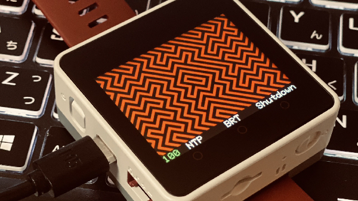

# Optical Illusion Watch on M5Stack (Core2)

 

## Overview

M5Stack Core2 用 錯視を利用した時計です。 
上段に時間、下段に分を表示していますが、斜線に隠れてなかなか見えないことでしょう。

時刻の数字を形作っているところは、斜線の向きが周囲と逆になっています。 
よく見ると、4つの数字がなんとなく浮かび上がってきます。 
急いでいる場合は、画面をタッチすることで簡単に答え合わせができます。

この錯視時計は、Tokyoflash Japan の 
**"Optical Illusion LCD Watch"** のディスプレイデザインを再現したものです。 
https://tokyoflash.com/products/optical-illusion-lcd-watch 
本家は既に販売を終了していますが、Tokyoflash Japan に承諾をいただいて、このコードの公開に至りました。

Wi-FiにてNTPサーバへ接続し、時刻同期が可能です。 
2.4GHzのSSIDとパスワードを設定してお使いください。

LCD輝度やディレイの調整次第で1日くらいもつかもしれませんが、 
バッテリ節約のために、最後の操作から一定時間でオートオフさせることもできます。

**お断り： 
NTP時刻同期までの作動は、RTCを内蔵するCore2でのみ確認済です。 
外部RTCが必要なモデルの時刻同期は未確認です。**

余談ですがM5Stack様公式ストアにて販売されている Development Board Watch Kit は、 
大変おすすめの品でございます。 
ご参考まで。

 

**THE STATEMENT FROM Tokyoflash Japan(https://tokyoflash.com):** 
**The original display design for the Optical Illusion watch is
copyrighted and is the intellectual property of Tokyoflash Japan.
It may only be used with permission.** 

_注意：_ 
_このソースコードは、M5StackでTokyoflash Japan の"Optical Illusion LCD Watch" のディスプレイデザインによる時計機能を再現します。_ 
_Tokyoflash Japan の声明により、このコードの複製・使用・改変・配布など一切の利用は非営利目的に限られ、個人利用にのみこれらの行為を許可します。いかなる形式であっても、このソースコードによるディスプレイデザインを営利目的に使用することを禁止します(つまりオープンソースソフトウェアではありません)。_ 
_このソースコードは、Tokyoflash Japan の許可を得て公開しています。_

 

開発環境： Ubuntu 22.04 LTS

## Usage

ファイルをダウンロードして、 
`m5_optical_illusion_watch.ino` を Arduino IDE にて書き込みください。

インタフェース | 操作        | アクション
---------------|-------------|--------------------------------
画面           | クリック     | 答え合わせを表示/非表示
BtnA           | ちょい長押し | Wi-Fi・NTPサーバ接続
BtnB           | ちょい長押し | バックライト的にLCD輝度切り替え(デフォルト・MAX)
BtnC           | ちょい長押し | 終了

 

## Customize

`m5_optical_illusion_watch.ino` の17〜60行内にて設定可能です。

- NTP同期時に接続するWi-FiのSSID
- NTP同期時に接続するWi-Fiのpw
- LCD輝度(0〜255で設定可)
- デフォルトで答え合わせを表示する/しない設定
- 背景色
- 文字色(バッテリ以外)
- **時刻表示 斜線の色**
- **時刻表示 背景色**
- バッテリ表示の各文字色
- BtnBでLCD輝度MAXにしたときの"BRT"の色
- 自動終了するまでの時間(秒) 
  *※ 0で自動終了自体を無効にできます*
- BtnC押下時・または一定秒間操作がなかったときに、powerOffまたはdeepSleepする設定 
  *※ お好みです。再度起動するときに電源ボタンを押す操作は同じです*
- 稼働中のディレイ(ms)

 

## Change Log

Date       | Version | Detail
-----------|---------|-------------------------------
2023/05/31 | 0.2.0   | 公開。
